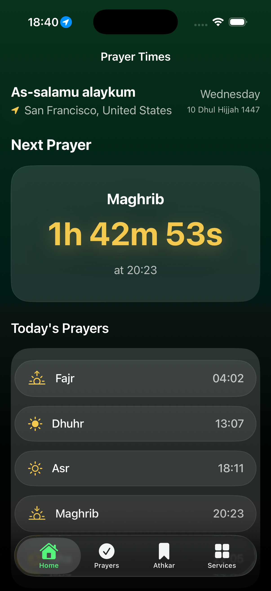
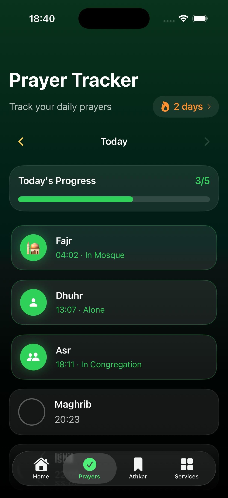
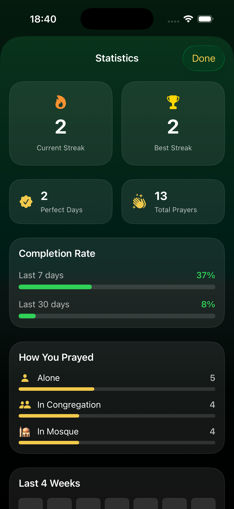
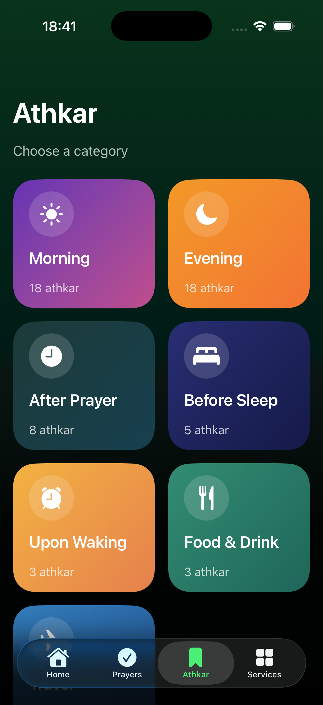
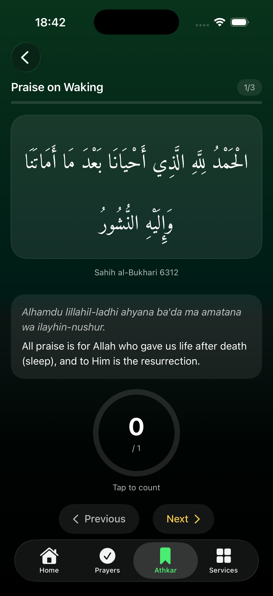
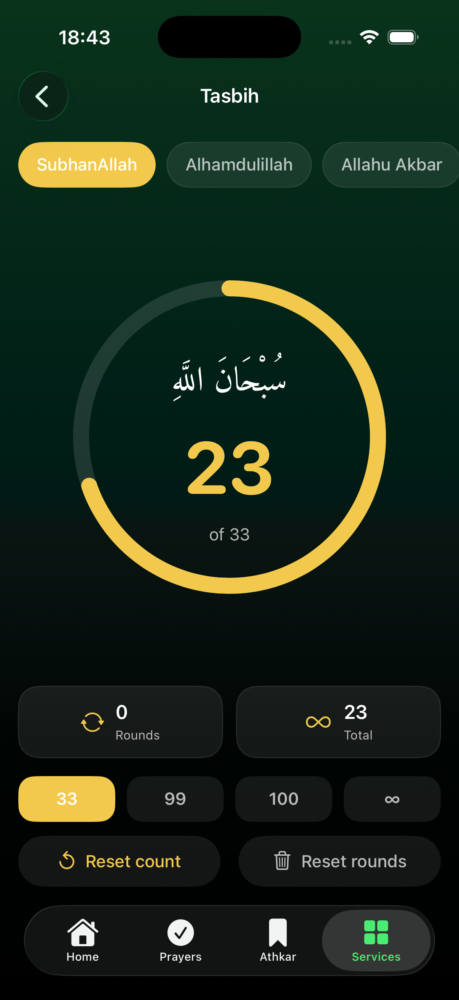
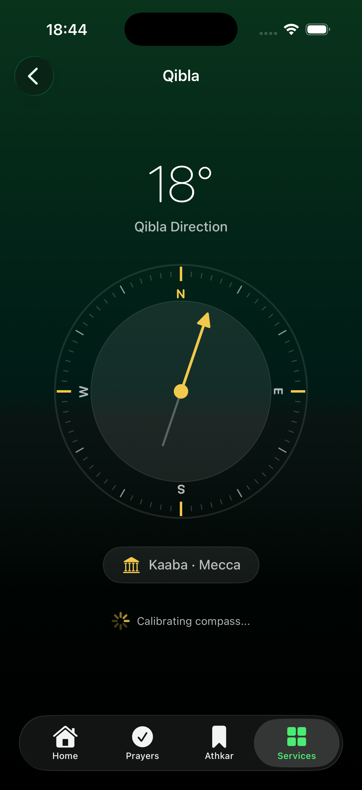
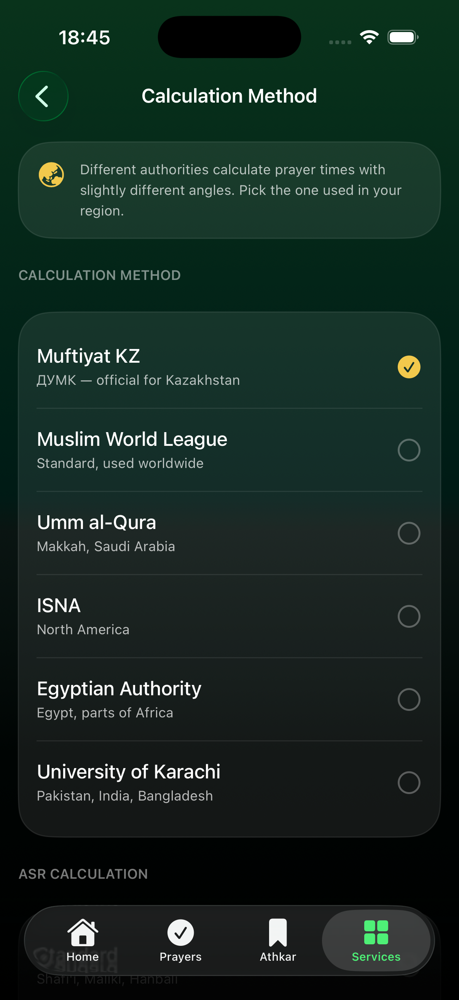
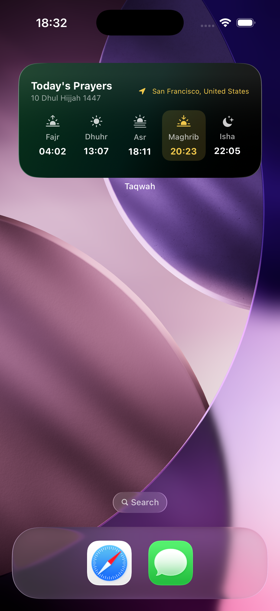

# Taqwah — Islamic Prayer Companion for iOS

> Your guiding light — accurate prayer times, prayer tracking, Athkar, Qibla, and more. Built natively in SwiftUI.

Taqwah is a polished, ad‑free Islamic companion app focused on Central Asia (Kazakhstan / Uzbekistan) while working worldwide. It combines the **official Muftiyat KZ (ДУМК)** prayer-time source with the global **Aladhan** API, a habit-forming prayer tracker, authentic Athkar, a live Qibla compass, a digital Tasbih, home/lock-screen widgets, and full localization.

<p align="center">
  
  
  
</p>
<p align="center">
  
  
  
</p>
<p align="center">
  
  
  
</p>

---

## Features

### 🕌 Prayer times
- **Dual data source** — official **Muftiyat KZ (ДУМК)** API for Kazakhstan, with automatic fallback to the global **Aladhan** API outside KZ.
- **6 calculation methods** — Muftiyat KZ, Muslim World League, Umm al-Qura, ISNA, Egyptian Authority, University of Karachi.
- **Hanafi / Standard Asr** selection.
- **Offline-first** — a full year is cached locally; the app works with no connection.
- Live **countdown** to the next prayer (counts to Sunrise after Fajr, as it should).
- Per‑prayer **minute adjustments**.

### ✅ Prayer tracker & statistics
- Mark each prayer by **how it was performed** — alone, in congregation, or in the mosque.
- **Edit past days** — log a late Isha after midnight without breaking your streak.
- **Statistics**: current & best streak, perfect days, total prayers, 7/30-day completion rate, a 4‑week heatmap, and a per-type breakdown.

### 📿 Worship tools
- **Athkar** — 7 categories (morning, evening, after prayer, before sleep, upon waking, food, travel) from *Hisn al-Muslim*, with a beautiful **Amiri Quran** typeface, tap-to-count, and saved daily progress.
- **Tasbih** — digital counter with preset adhkar, 33/99/100/∞ targets, rounds, lifetime total, and haptics.
- **Qibla compass** — live magnetometer-based direction to the Kaaba.

### 🔔 Notifications & widgets
- Local **prayer notifications**, optional **pre-prayer reminder**, and a special **Jummah** (Surah Al-Kahf) message on Fridays.
- **Home & Lock-Screen widgets** — Next Prayer (with live timer) and Today's Prayers, plus tap‑to‑open deep links.

### 🌍 Personalization
- **4 languages**, switchable instantly with no restart: **English, Русский, Қазақша, Oʻzbekcha**.
- **Light / Dark / System** themes.
- **Tip Jar** (StoreKit 2) and **iCloud Key‑Value sync** across devices.

---

## Tech stack & highlights

| Area | Details |
|---|---|
| **UI** | 100% **SwiftUI**, light/dark adaptive design system, custom widgets |
| **Concurrency** | `async/await`, structured concurrency (`TaskGroup`) for parallel month fetches |
| **Networking** | Two REST APIs (Muftiyat KZ + Aladhan) with graceful fallback & offline cache |
| **Widgets** | **WidgetKit** + **App Groups** for app↔widget data sharing; `TimelineProvider` |
| **Payments** | **StoreKit 2** consumable Tip Jar |
| **Sync** | **NSUbiquitousKeyValueStore** (iCloud), no login required |
| **Notifications** | `UNUserNotificationCenter` calendar triggers |
| **Location** | `CoreLocation` for city + Qibla heading |
| **Localization** | **String Catalog** (`.xcstrings`) + runtime locale switching |
| **Fonts** | Bundled **Amiri Quran** registered at runtime via Core Text |

### Architecture
```
Taqwah/
├── Core/
│   ├── Models/        # PrayerDay, CalculationMethod, Athkar data
│   ├── Services/      # Managers: prayer times, tracker, notifications,
│   │                  # location, tasbih, cloud sync, localization, widgets
│   └── Utils/         # Date / Hijri helpers, font registration
├── UI/
│   ├── Screens/       # Home, Prayers, Athkar, Services + settings
│   └── Components/    # Shared views (background, splash)
└── Resources/Fonts/   # Amiri Quran
TaqwahWidget/          # WidgetKit extension
```

---

## Build & run
- **Xcode 26+**, **iOS 26+**, Swift 5.
- Open `Taqwah.xcodeproj`, select the `Taqwah` scheme, and run.
- For Tip Jar testing in the simulator: Edit Scheme → Run → Options → StoreKit Configuration → `Taqwah.storekit`.

---

## Credits
- Prayer times: [Muftiyat KZ (ДУМК)](https://namaz.muftyat.kz/ru/namaz/api/) & [Aladhan API](https://aladhan.com).
- Athkar: *Hisn al-Muslim* (Fortress of the Muslim).
- Arabic typeface: [Amiri Quran](https://github.com/alif-type/amiri) (OFL).

## Author
Built by **Abbos Oktambayev** as a labour of love — free, ad‑free, *sadaqah jariyah*. 🤲
